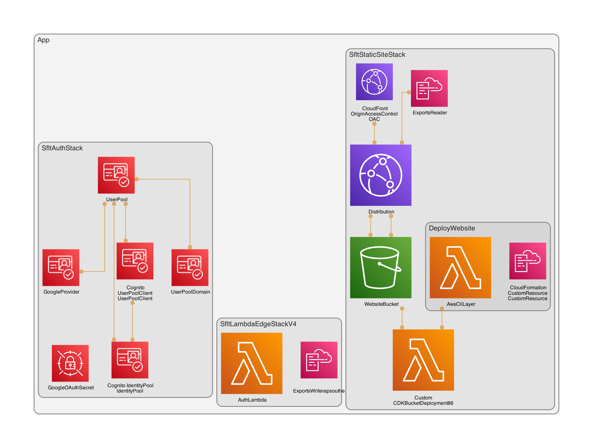

# SFLT - Static Frontend Deployment

AWS CDK Python project for deploying a static React website to CloudFront with S3 origin using Origin Access Control (OAC).

## Prerequisites

- Python 3.12+
- Node.js 18+
- AWS CLI configured with appropriate credentials
- [uv](https://github.com/astral-sh/uv) - Python package manager

## Setup Google Identity

- Head to the google cloud console https://console.cloud.google.com/apis/dashboard
- Create a new project
- Enable the identitytoolkit https://console.cloud.google.com/apis/api/identitytoolkit.googleapis.com/metrics
- Then let's configure the OAuth Consent Screen https://console.cloud.google.com/auth/overview


## Quick Start

1. Install dependencies:
   ```bash
   make install
   ```

2. Bootstrap AWS CDK (first time only):
   ```bash
   make bootstrap
   ```

3. Deploy the stack:
   ```bash
   make deploy
   ```

4. Access your website using the CloudFront URL shown in the output.

## Development

### Frontend Development

Start the local development server:
```bash
make dev
```

### Running Tests

Run all tests:
```bash
make test
```

Run E2E tests against deployed CloudFront:
```bash
make test-e2e
```

Run E2E tests against local dev server:
```bash
make test-e2e-local
```

Run console error detection tests:
```bash
make test-console-errors
```

### Debugging and Verification

To verify the console error detection work:
1. Start local dev server: `make dev`
2. Run console error test: `make test-console-errors`
3. View test results at `http://localhost:9323`

### Linting

```bash
make lint
```

## Project Structure

- `app.py` - CDK application entry point
- `cdk/` - CDK infrastructure code
- `frontend/` - React application
- `tests/` - Python tests
- `Makefile` - Build orchestration

## Architecture



The stack creates:
- Private S3 bucket with encryption
- CloudFront distribution with OAC
- Automatic deployment of React build artifacts
- Cognito User Pool with Google OAuth integration
- Lambda@Edge function for authentication

To regenerate the architecture diagram:
```bash
make diagram
```

## Useful Commands

- `make build` - Build frontend and synthesize CDK
- `make diff` - Compare deployed stack with current code
- `make destroy` - Remove all resources
- `make clean` - Clean build artifacts

## Coding Standards

This repository follows strict coding standards to maintain quality and organization:

### 1. Repository Hygiene
- **Keep the root directory clean** - No temporary files should be placed in the repository root
- **Use the `tmp/` directory** - All temporary and generated files go in `tmp/` (gitignored)
- **Run `make clean`** - Regularly clean up temporary files and build artifacts

### 2. Temporary File Organization
```
tmp/
├── test-artifacts/    # Test outputs, logs, temporary test data
├── lambda-analysis/   # Downloaded Lambda code for analysis
├── screenshots/       # Playwright and E2E test screenshots
└── build-artifacts/   # Temporary build outputs
```

### 3. Testing Philosophy
- **Write tests, not scripts** - Always create proper automated tests instead of one-off terminal commands
- **Test data belongs in tests** - If you need test events or data, add them to the test suite
- **Use appropriate test frameworks**:
  - Frontend unit tests: `frontend/src/test/` (Vitest)
  - Frontend E2E tests: `frontend/e2e/` (Playwright)
  - Python tests: `tests/` (pytest)

### 4. Development Workflow
```bash
# Always orient to repository root
cd $(git rev-parse --show-toplevel)

# Before committing code
make lint    # Run all linters
make format  # Format all code
make test    # Run all tests

# Clean up regularly
make clean   # Remove all temporary files
```

### 5. Documentation
- Update `CLAUDE.md` with infrastructure changes and working notes
- Keep this README updated for end users
- Document complex logic with clear comments in code